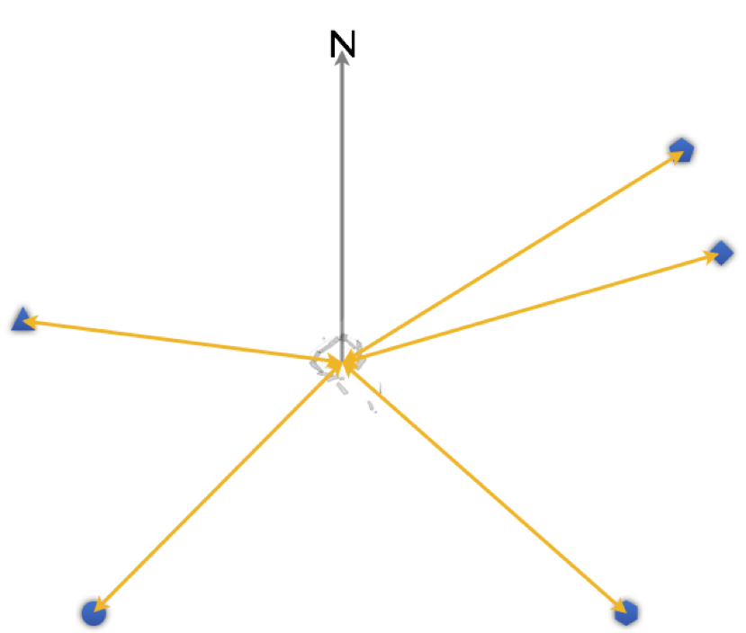

This tool estimates the magnetic declination (difference between magnetic and true north) using the radial GPS technique of Silva (2010).

In the field:

* (1)	With the site of interest at the centre choose four or more markers (the reference points) in the local landscape (the blue shapes in the figure above). The more you choose the better, but four to six seems to give good results. Still at your site, measure their azimuths with your compass;

* (2) Move to each of the markers you’ve chosen and take their GPS coordinates. (Remember to measure the azimuth from each of these markers to your site as well to check, and correct for, local anomalies);

On _skyscapeR_:

* (3) Insert the GPS coordinates of your site at the top of the _skyscapeR_ tool page;

* (4) Insert the GPS coordinates and azimuth to your first reference point in the appropriate section;

* (5) Click on the + button to add another marker;

* (6) Repeat steps (4) and (5) until all of your reference point data has been input;

* (7) Press the Calculate button.

_Reference:_

Silva, Fabio (2010). A New Survey of Neolithic Dolmens in Central Portugal. _Journal of Cosmology_ 9: 3094-3106. Available online [here](http://journalofcosmology.com/AncientAstronomy109.html)
